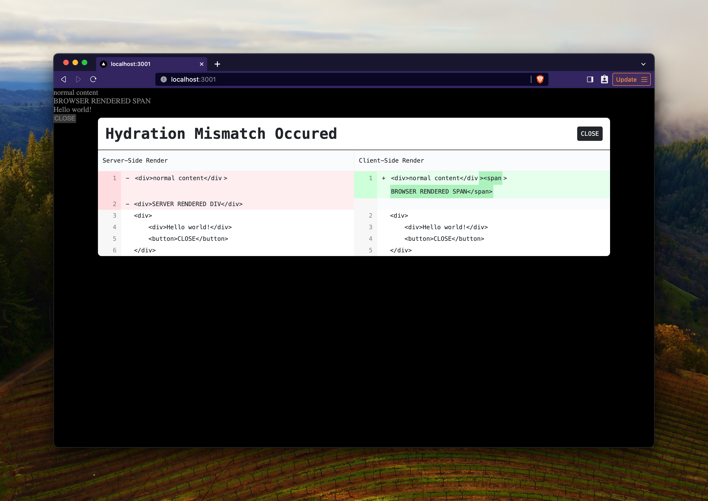

# Hydration Overlay 🕵️

This package displays an overlay during Hydration Errors, providing an explicit diff between the server-side and client-side renders.



## Installation

```bash
npm install @builder.io/react-hydration-overlay
```

## Usage

### `HydrationOverlay`

First, wrap the root of your app in the `HydrationOverlay` component.

```tsx
import { HydrationOverlay } from "@builder.io/react-hydration-overlay";

const App = () => {
  return (
    <HydrationOverlay>
      <YourApp />
    </HydrationOverlay>
  );
};
```

Or, in the Next.js App Router, wrap `{children}` in your [root layout](https://nextjs.org/docs/app/building-your-application/routing/pages-and-layouts#root-layout-required):

```tsx
import { HydrationOverlay } from "@builder.io/react-hydration-overlay";

export default function RootLayout({ children }) {
  return (
    <html lang="en">
      <body>
        <HydrationOverlay>{children}</HydrationOverlay>
      </body>
    </html>
  );
}
```

### Plugin

Second, add the plugin for your framework. Currently, we support Next.js & webpack.

#### Next.js

in `next.config.js`:

```js
const {
  withHydrationOverlay,
} = require("@builder.io/react-hydration-overlay/next");

/** @type {import('next').NextConfig} */
const nextConfig = {
  /** your config here */
};

module.exports = withHydrationOverlay({
  /**
   * Optional: `appRootSelector` is the selector for the root element of your app. By default, it is `#__next` which works
   * for Next.js apps with pages directory. If you are using the app directory, you should change this to `main`.
   */
  appRootSelector: "main",
})(nextConfig);
```

#### webpack

Here is an example (still with Next), but using the webpack helper directly:

```ts
const {
  withHydrationOverlayWebpack,
} = require("@builder.io/react-hydration-overlay/webpack");

/** @type {import('next').NextConfig} */
const nextConfig = {
  reactStrictMode: true,
  webpack: (config, options) => {
    config = withHydrationOverlayWebpack({
      appRootSelector: "#__next",
      isMainAppEntryPoint: (entryPointName) =>
        !options.isServer &&
        (entryPointName === "pages/_app" || entryPointName === "main-app"),
    })(config);
    return config;
  },
};

module.exports = nextConfig;
```

## Notes

- This package is currently in beta. Please report any issues you find!
- This package is not intended for production use. We highly recommend you remove this package from your production builds.

## Caveats

This package works by comparing the HTML received from the server with the HTML rendered by the client, which has one important consequence. React re-renders the entire app when hydration fails, potentially introducing even more changes.

The biggest example is `style` attributes: React appends `;` to each one and alters the whitespace. In [more extreme examples](https://x.com/samijaber_/status/1734760349662957906?s=20), it causes enormous diffs for properties like `all: unset`.

Therefore, this tool will give you false positives for style changes.

## How It Works

- The plugin injects `hydration-overlay-initializer.js` into your app's entry point. This script reads the HTML from the server and stores it, and then listens for hydration errors and stores the resulting HTML then.
- The `HydrationOverlay` component reads both HTML strings and compares them, and renders the overlay.

## Support

To add support for other frameworks, what is needed is a plugin that injects the `hydration-overlay-initializer.js` script into the app's entry point. See [next.ts](./packages/lib/src/next.ts) plugin for more information. PRs welcome!

- [x] Next.js
- [ ] Remix
- [ ] Vite SSR

## Release process

### Add changesets

in the same PR where your change is made, run:

```
pnpm c:add
```

and follow instructions to add changesets. You can then merge your PR.

### Merge automated PR

Once your PR is merged, the `changeset` bot will open a PR with the changeset. You can merge this PR once CI passes. This will trigger a release.


<br>
<br>

<p align="center">
   <a href="https://www.builder.io/m/developers">
      <picture>
         <source media="(prefers-color-scheme: dark)" srcset="https://user-images.githubusercontent.com/844291/230786554-eb225eeb-2f6b-4286-b8c2-535b1131744a.png">
         
       </picture>
   </a>
</p>
