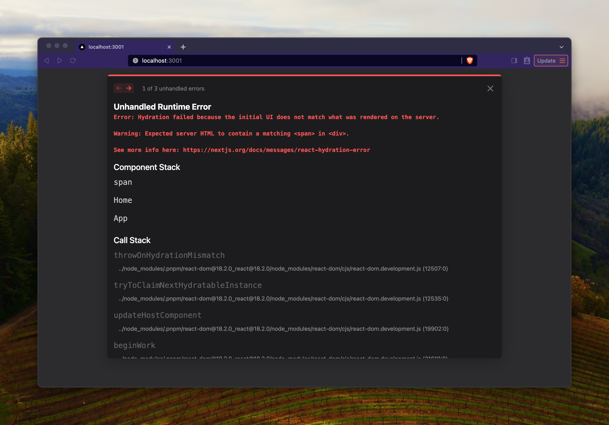

# Hydration Overlay 🕵️

This package displays an overlay during Hydration Errors, providing an explicit diff between the server-side and client-side renders.

Before | Afterß

<div style="display: flex;">
  
  
</div>

## Installation

```bash
npm install @builder.io/react-hydration-overlay
```

## Usage

### `HydrationOverlay`

First, wrap the root of your app in the `HydrationOverlay` component.

```tsx
import { HydrationOverlay } from "@builder.io/react-hydration-overlay";

const App = () => {
  return (
    <HydrationOverlay>
      <YourApp />
    </HydrationOverlay>
  );
};
```

### Plugin

Second, add the plugin for your framework. Currently, we only support Next.js.

#### Next.js

in `next.config.js`:

```js
const {
  withHydrationOverlay,
} = require("@builder.io/react-hydration-overlay/next");

/** @type {import('next').NextConfig} */
const nextConfig = {
  /** your config here */
};

module.exports = withHydrationOverlay()(nextConfig);
```

## Notes

- This package is currently in beta. Please report any issues you find!
- This package is not intended for production use. We highly recommend you remove this package from your production builds.

## Caveats

This package works by comparing the HTML received from the server with the HTML rendered by the client, which has one improtant consequence. React re-renders the entire app when hydration fails, potentially introducing even more changes.

The biggest example is `style` attributes: React appends `;` to each one and alters the whitespace. In [more extreme examples](https://x.com/samijaber_/status/1734760349662957906?s=20), it causes enormous diffs for properties like `all: unset`.

Therefore, this tool will give you false positives for style changes.

## How It Works

- The plugin injects `hydration-overlay-initializer.js` into your app's entry point. This script reads the HTML from the server and stores it, and then listens for hydration errors and stores the resulting HTML then.
- The `HydrationOverlay` component reads both HTML strings and compares them, and renders the overlay.

## Support

To add support for other frameworks, what is needed is a plugin that injects the `hydration-overlay-initializer.js` script into the app's entry point. See [next-plugin.ts](./packages/lib/src/next-plugin.ts) for more information. PRs welcome!

- [x] Next.js
- [ ] Remix
- [ ] Vite SSR
